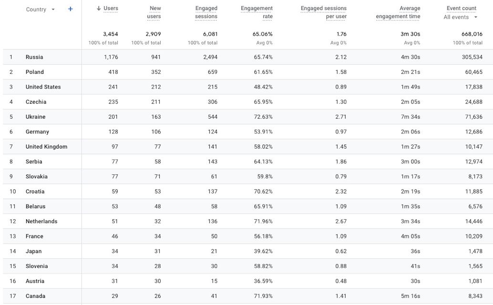
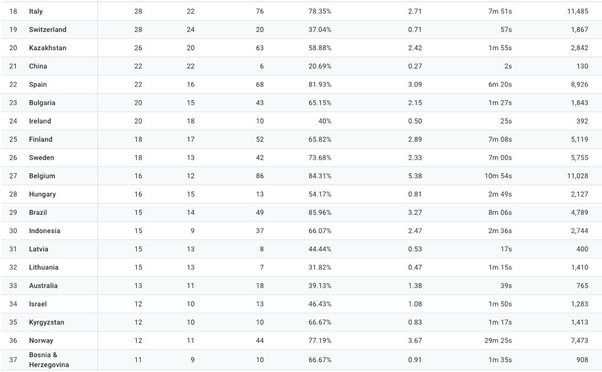
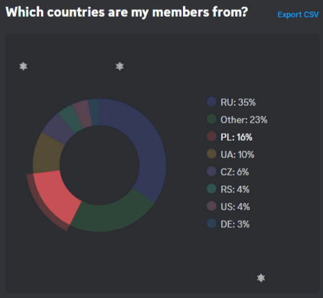

# Where is the Interslavic language used?

*author: Neudržima Mašina Dobra*

We have some statistics from interslavic-dictionary.com

## Monthly stat by country:

## Monthly stat by towns

## Monthly stat by languages

## Interslavic dictionary usage in the world

## And countries and languages data of the official Discord server

